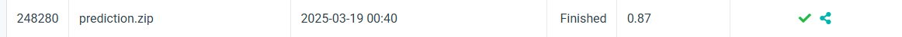

# NYCUCV2025HW1

<p>Student ID: 111550029</p>
<p>Name: 蔡奕庠</p>

## Introduction 

<p>For my Visual Recognition assignment, I initially used ResNet18 but found it failed to generalize (100% train accuracy, 60% val accuracy). Upgrading to ResNet34 didn’t help, so I investigated the dataset. The test images contained significant noise, making fine-grained classification difficult.  </p>

<p>To improve performance, I embedded attention mechanisms into ResNet blocks and switched to ResNet50, achieving 80% accuracy. Further experimentation with Res2Net and ResNext led to a ResNext50-based model reaching 87% accuracy. I also applied data augmentation (cropping, flipping, rotation, jittering, erasing) to enhance generalization.  </p>

<p>Limited by computational resources, I paused at 87% accuracy but plan to explore contrastive learning once I gain access to better hardware.</p>

## How to install
Follow these steps to set up and run the project:

### 1. Clone the repository
```bash
git clone https://github.com/yourusername/your-repo.git
cd your-repo
```

### 2. Create a virtual environment
```bash
conda create --name my_env python=3.10
conda activate my_env
```
### 3. Install dependencies
```bash
pip install -r requirements.txt
```

### 4. Set up your dataset
```bash
project_root/
│── data/
│   ├── train/
│   ├── val/
│   ├── test/
```
### 5. Run the main script
```bash
python main.py
```
## Performance snapshot
